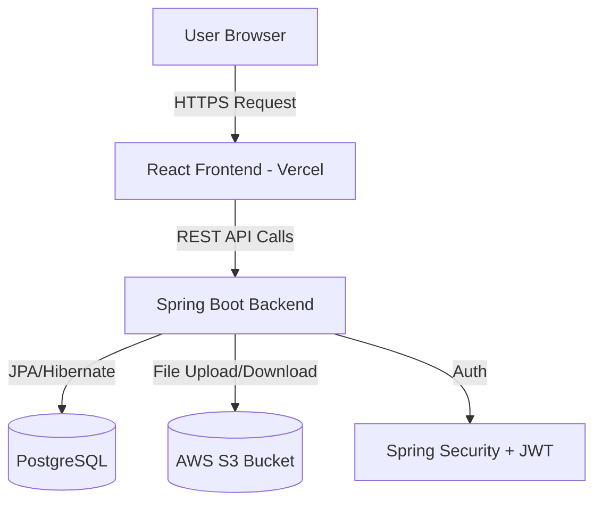
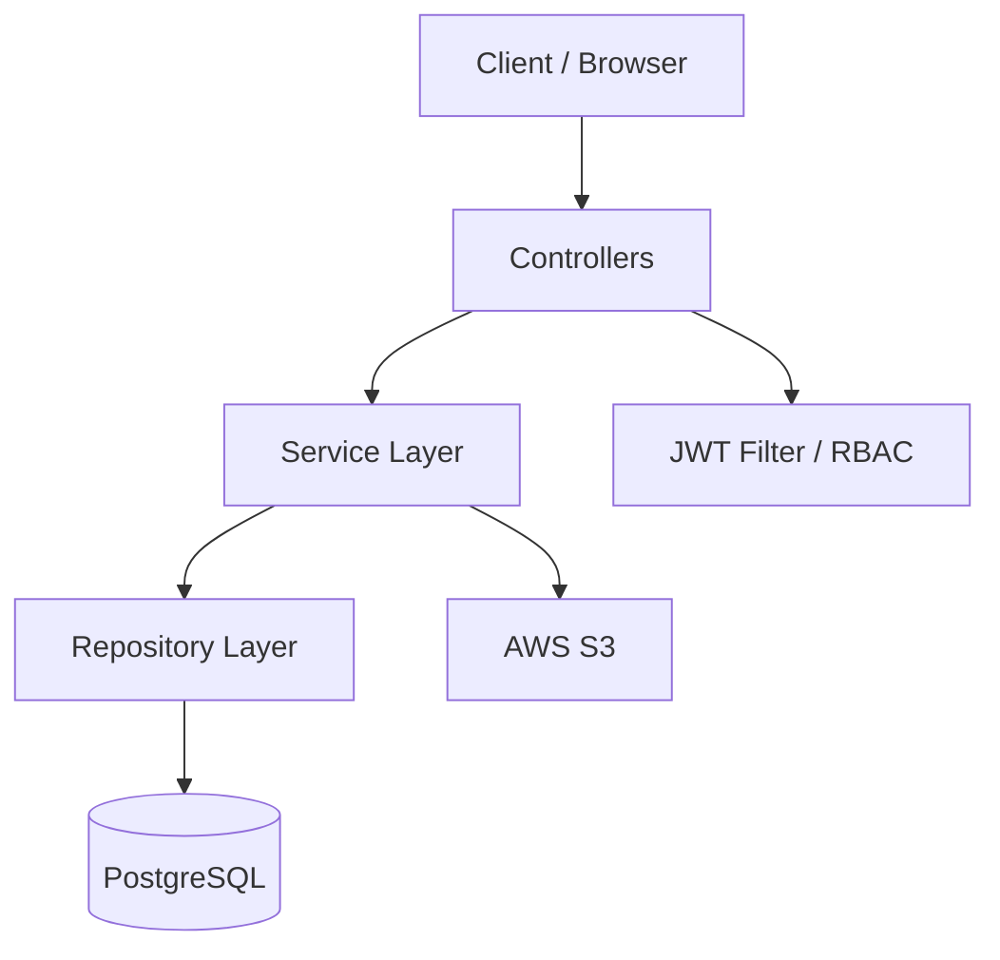
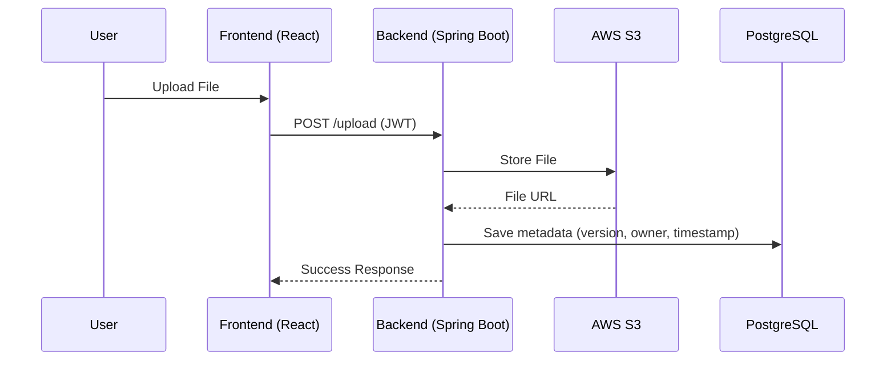
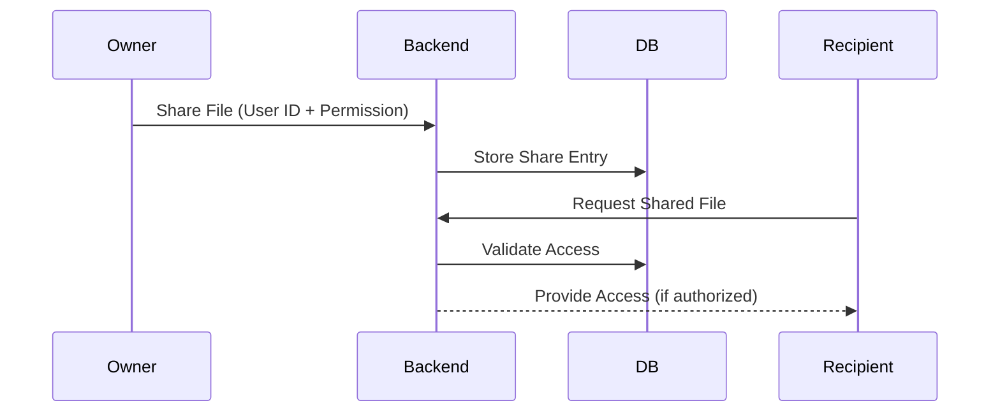
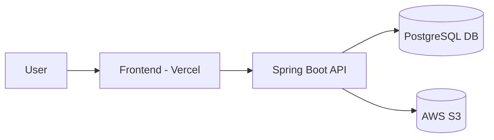

# CloudNest ☁️  
### Modern Personal Cloud Storage Platform  

CloudNest is a powerful, secure, and scalable personal cloud storage platform designed to help users store, manage, and collaborate on digital assets seamlessly. Built with a production-grade architecture and deployed using modern cloud infrastructure, CloudNest delivers a smooth, secure, and enterprise-ready experience.

---

## 🌐 Live Deployment

🚀 **Live Application:**  
👉 https://cloud-nest-frontend.vercel.app/

---

## 📸 Product Preview

<!-- Add screenshots here -->
<!-- Example:

-->

---

# 🏗️ System Architecture

## 🔷 High-Level Architecture



---

## 🔷 Backend Layered Architecture (Clean Architecture)



---

## 🔷 File Upload Flow



---

## 🔷 Secure File Sharing Flow



---

# 🚀 Core Features

## 📁 File Management
- Upload & download files securely
- File versioning with history tracking
- Soft deletion & metadata management
- Cloud-backed storage using AWS S3

## 👥 Collaboration & Sharing
- Secure file sharing between users
- Permission-based access control
- Real-time notifications for shared activities

## 🔐 Security
- JWT-based authentication
- Role-Based Access Control (RBAC)
- Password encryption
- Protected API endpoints
- Secure S3 bucket integration

## 📊 Dashboard
- Clean, intuitive UI
- File activity tracking
- Shared file overview
- Version control history

---

# 🛠️ Tech Stack

## 🔷 Frontend
- **Framework:** React (Vite)
- **Routing:** React Router
- **HTTP Client:** Axios
- **Icons:** Lucide React
- **Deployment:** Vercel

## 🔷 Backend
- **Framework:** Spring Boot 3.3.5
- **Language:** Java 17
- **Security:** Spring Security + JWT
- **Database:** PostgreSQL
- **Migration Tool:** Flyway
- **File Storage:** AWS S3
- **Build Tool:** Maven

---

# 📂 Project Structure

```text
CloudNest/
├── CloudNest-frontend/        # React frontend application
│   ├── src/
│   ├── components/
│   ├── pages/
│   └── services/
│
└── cloud-nest-backend/        # Spring Boot backend application
    ├── controller/
    ├── service/
    ├── repository/
    ├── security/
    ├── config/
    └── resources/
```

---

# ⚙️ Getting Started

## ✅ Prerequisites

- JDK 17+
- Node.js v18+
- PostgreSQL
- AWS Account (S3 bucket configured)

---

## 🔹 Installation

### 1️⃣ Clone Repository

```bash
git clone https://github.com/your-username/CloudNest.git
cd CloudNest
```

---

### 2️⃣ Backend Setup

```bash
cd cloud-nest-backend
```

Configure:

```properties
spring.datasource.url=jdbc:postgresql://localhost:5432/cloudnest
spring.datasource.username=your_username
spring.datasource.password=your_password

aws.accessKey=YOUR_KEY
aws.secretKey=YOUR_SECRET
aws.bucketName=YOUR_BUCKET
```

Run:

```bash
./mvnw spring-boot:run
```

---

### 3️⃣ Frontend Setup

```bash
cd CloudNest-frontend
npm install
npm run dev
```

---

# 🔐 Security Implementation

CloudNest follows production-grade security standards:

- Stateless JWT authentication
- Token-based session management
- BCrypt password hashing
- Endpoint-level authorization
- Secure AWS IAM configuration
- Database migration version control via Flyway

---

# 🧪 Testing Strategy

- Unit testing for service layer
- Integration testing for controllers
- Manual API testing via Postman
- End-to-end validation through frontend

---

# 📈 Scalability & Design Principles

- Layered architecture (Controller → Service → Repository)
- Separation of concerns
- Cloud-native file storage
- Horizontal scalability ready
- Clean code & modular design
- Database migration tracking

---

# 🌍 Deployment Architecture



---

# 💡 Future Enhancements

- Presigned S3 URLs for direct uploads
- Activity logs dashboard
- Two-factor authentication
- WebSocket-based real-time collaboration
- Mobile app integration

---

# 🤝 Contributing

We welcome contributions to improve CloudNest.

1. Fork the repository
2. Create a feature branch
3. Commit changes
4. Open a Pull Request

---

# 📄 License

Licensed under the MIT License.

--- 

# ⭐ Why CloudNest Stands Out

✔ Production-ready backend  
✔ Secure cloud storage integration  
✔ Clean architecture  
✔ Scalable system design  
✔ Modern React frontend  
✔ Real-world deployment  

---

> Built with passion for scalable cloud-native systems ☁️🚀
